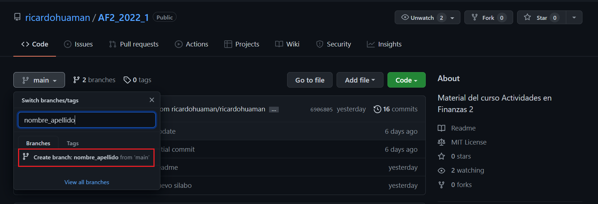

 

# Actividades en Finanzas 2
## Valuación de Opciones y Simulaciones de Monte Carlo en R
---
## Semana 2: GitHub
---

 

&nbsp;
## Primeros pasos:  [1](#myfootnote1)

### Antes de empezar, es importante tener en cuenta lo siguiente:

1. Asegúrese de tener una cuenta en Github. Si aún no cuenta con una, créela siguiendo las indicaciones del siguiente enlace: https://github.com/join  
    * (Dato adicional: si usa su email @pucp, puede postular a https://education.github.com/students para obtener una cuenta Pro)
2. Una vez que creada su cuenta, mande su nombre de usuario a rhuaman@pucp.edu.pe, con el siguiente asunto: **_AF2 - Nombre de Usuario Github_**
3. Intale Github Desktop. En caso de que aún no lo tenga, vaya a https://desktop.github.com/ e instálelo. 
4. Inicie sesión en Github Desktop con su cuenta creada. 
5. Recibirá por correo una invitación de colaborador al repositorio del curso https://github.com/ricardohuaman/AF2_2022_1
6. Finalmente, acepte la invitación al repositorio. 

    

7. Luego de haber completado estos pasos, usted será colaborador del repositorio.

### ¿Qué es un contributor? 

Es alguien que contribuye con los proyectos o tareas dentro de un repositorio (*repo*). Asimismo, entiende y sigue instrucciones del administrador del repo (*repo maintainer*). 

<a name="myfootnote1">1</a> Este material se basa fuertemente en los entrenamientos de [DIME](https://github.com/worldbank/dime-github-trainings), del Banco Mundial. 

&nbsp;
## USANDO GITHUB
---

## ¿Qué es Github?

- Github nos ayuda a solucionar el conocido problema del "Documento_Final.docx".

    

- Freste a esto, comúnmente, nuestra solución más rápida es llamar a nuestros documentos 
    - Paper_for_review_csu_200321.docx
    - Paper_for_review_csu_200321_ae_comments.docx
    - Paper_for_review_csu_200321_ae_comments_final.docx
    - Paper_for_review_csu_200321_ae_comments_final_v2.docx

- En este contexto, la ventaja de Github es que trackea cada edición hecha al documento. 

- En adición a esto, Github también ayuda a resolver los problemas de copia conflictiva, muy comunes en Dropbox; y también es posible conocer quiénes son o fueron los autores de documentos colgados en GitHub.

&nbsp;

Hay 3 conceptos importantes a manejar: 

## 1. Clone (clonar)
___

Clonar es similar a descargar un repositorio. 
La diferencia entre clonar y descargar es que **Github recuerda de dónde descargamos el repositorio**. Esto es necesario para saber a dónde mandar nuestros cambios cuando seamos contributors. 

### ¿Cómo clonar un repo?
1. Ve a https://github.com/ricardohuaman/AF2_2022_1
2. Haz click en el botón verde que dice *Code*

     

3. Haz click en *Open with Github Desktop*

     

4. Si aparece este mensaje en su navegador, haga click en *Abrir*

     

4. Inmediatamente después, será redirigido a la aplicación de escritorio de Github Desktop. Le aparecerá la siguiente ventana. Haga click en *Choose* y seleccione la carpeta de su computadora en donde desee clonar el repo. (**NO lo clone en una carpeta compartida de Dropbox, Box, Google Drive, etc.**) 

     

6. Finalmente, haga click en el botón azul *Clone* y ya habrá clonado el respositorio del curso en su computadora. Ahora ya podrá acceder a los archivos y contribuir en el repo.  

     

7. La vista que tendrá en el GitHub Desktop será la siguiente: 

    * Verificamos que estamos en el repositorio correcto:
        * Current repository: **AF2_2022_1**
        * Current branch: **main**
        * **Fetch origin**: Last fetched ***** (se recomienda hacer click en fetch origin antes y después de contribuir en el repo. Es una forma de "Actualizar" las nuevas modificaciones hechas en el repo.)
         

             

&nbsp;
## 2. Commit 
___

- ¿Qué es un control de versiones? 

    Todas las versiones de un documento en Google Doc están almacenadas. Así, se pueden ver la cantidad de modificaciones que hizo cada contribuidor al documento, y la fecha y hora de registro.

     

    Ahora bien, para no tener que almacenar todas estas versiones, Git usa los ***commits*** para indicar las diferencias significativas entre versión y versión.

    Cada commit funciona como una captura de los archivos del proyecto en determinado momento, y lo compara respecto al commit anterior. Además, cada commit tiene un timestamp (dentro de este ya tiene un id que incluye fecha y hora). 

&nbsp;
* ¿Cómo hacer un commit ? 

    Antes de hacer un commit, es necesario saber cómo funcionan los branches. Por el momento, haremos un ejercicio práctico. 
    
    - **ACTIVIDAD EN CLASE**: 
        - En la Tarea Semanal 1, elaboró en Overleaf un documento en Látex. Se le pide que suba al repo del curso el archivo .tex que se descarga de dicho proyecto en Overleaf.

    - PASOS: 
        1. Abra GitHub Desktop y dele click en *Fetch origin*. Esto nos permitirá actualizar en nuestra computadora cualquier cambio realizado en el repo del curso.
        2. Ingrese a su cuenta en Overleaf, y vaya a la pestaña de Proyectos: https://www.overleaf.com/project
        3. Una vez ubicado el documento en cuestión, descárguelo haciendo click en el siguiente botón: 

             

        4. Inmediatamente después, se descargará un archivo .zip. Dentro de él, el documento que se necesitará para completar la actividad en clase es el siguiente: 

            

        5. Ahora vaya a la carpeta en donde clonó el repositorio del curso. 

        6. Dentro de la carpeta *tareas*, vaya a la subcarpeta *TS2*.

            

        7. Una vez ubicado ahí, suba el archivo .tex. (**NOTA:** Recuerde subir el archivo .text con el siguiente formato: *nombre_apellido_TS1*)

        8. Ahora vaya al GitHub Desktop. Le aparecerá algo similar a lo siguiente:

               

            Todo aquello resaltado en verde debe entenderse como "entradas" al documento. Por otro lado, lo resaltado en rojo se reconoce como "salidas" o cualquier "delete" realizado a las líneas de código. 

            Cualquier modificación que se haga dentro de la carpeta clonada tendrá un sync inmediato en el GitHub Desktop. 

        9. Ahora bien, para que este nuevo archivo, subido a la carpeta clonada, se vea en el repositorio del curso (*para que suba a la nube del repo*), debe añadir un pequeño comentario sobre **Summary (required)**. Esto hará que el botón azul **Commit to main** se active, y se pueda hacer el merge con el main branch del repo. 

             

        10. Ahora podemos empezar a explorar el repo actualizado https://github.com/ricardohuaman/AF2_2022_1

&nbsp;
## 3. Branch 
---

- Los branches son la propiedad más interesante de Git. Esto hace a Git una herramienta poderosa de colaboración y no solo de control de versiones.

- Los branches **permiten crear una copia del código donde puedes experimentar/jugar** con él. Si te gusta el resultado, **puedes mergear el experimento a la versión principal (main branch)**.

- Esta versión no-lineal es más fidedigna a cómo se trabaja en la vida real. 

     

 

## Explorando branches

¿Cual es la versión clonada en tu computadora? Cuando se clona un repo **todas las versiones** son clonadas, pero **solo una** es la que se muestra en nuestra carpeta. 

Un flujo de trabajo típico en Git implica tener varias ramas (branches). Hay otras herramientas en Github que vuelven a este flujo de trabajo muy manejable; sin embargo, está fuera del alcance de los propósitos del curso.

 

## Creando un branch

- Ve a https://github.com/ricardohuaman/AF2_2022_1, y haz click al botón que dice *(símbolo branch) main*. **Asegúrese que sea el main.**

     

- Cree su branch llamado "nombre_apellido" en el cuadro de diálogo y dale click a lo encerrado en rojo para crear la rama. 

     

- ¡Ahora ya puedes realizar modificaciones al repo de forma independiente!

 

### Pull requests 

Una propiedad adicional a los branches es el **pull request**
Cuando las ediciones realizadas están listas para ser mergeadas con el *main*, puedes hacer un pull request, lo cual integrará tus ediciones en la rama *main*. 

Es común que el acceso a la rama *main* solo la tenga el repo maintainer (no todos los contribuidores).

- Ve a https://github.com/ricardohuaman/AF2_2022_1/pulls y dale click a *New pull request*
- Asegúrese de que la branch *main* esté seleccionada como *base:* branch. 
- Selecciona tu branch como *compare:* branch
- Scrollea para ver que tus ediciones son las que quieres que se integren con la main branch, dale click a *Create pull request*

 

----
## TAREA SEMANAL 2:
---

### Trabaje sobre el proyecto realizado en Overleaf en la Tarea Semanal 1. Se le pide que .... Finalmente, dado que su archivo *nombre_apellido.tex* ha sido modificado, se le pide subirlo al  repo del curso, en la carpeta TS2.

 

* Pasos para colaborar en el repositorio:

    * Cree un branch con el siguiente nombre: *nombre_apellido*
    * El GitHub Destop, dele click en Fetch Origin para actualizar los cambios, y seleccione su branch. Ahora empezaremos a hacer las modificaciones al repo.
    * Suba el archivo *nombre_apellido.tex*, el que ha sido modificado, a la carpeta TS2 en su computadora.
    * Abra el tab de cambios (changes) en Github Desktop. Github desktop se ha dado cuenta que hay nuevos cambios en su archivo.
    * Genere un commit. Escriba un mensaje de commit.
    * Selecciones *Push Origin*  

         

    * Seleccione *Create Pull request*. Esta acción lo dirigirá a una ventana en el navegador.

         

    * Haga click nuevamente en *Create Pull request*.

         

    * Haga click en *Merge Pull Request*.

        
            
    * Luego, haga click en *Confirm Pull Request*

         

    * **IMPORTANTE:** Finalmente, elimine su branch dando click en *Delete branch*.
        
         
  

 

### Aprender Github desde el command line: 

- En este tutorial, hemos lo visto los elementos esenciales para utilizar Github,; sin embargo, hay una forma de usar Github desde la consola. Aquí hay una lista de referencias en caso desee explorar más sobre este uso: https://education.github.com/git-cheat-sheet-education.pdf

